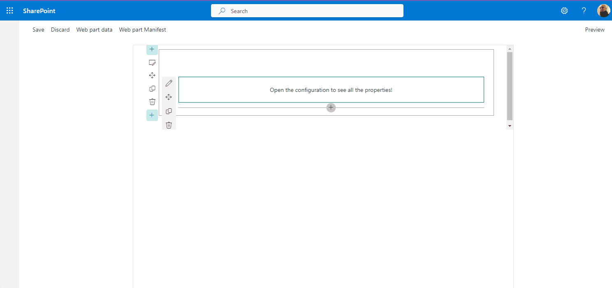

# Property Pane Navigation

## Summary

This sample showcase how to handle the navigation between property pane pages.



## Used SharePoint Framework Version


## Applies to

- [SharePoint Framework](https://aka.ms/spfx)
- [Microsoft 365 tenant](https://docs.microsoft.com/en-us/sharepoint/dev/spfx/set-up-your-developer-tenant)

> Get your own free development tenant by subscribing to [Microsoft 365 developer program](http://aka.ms/o365devprogram)


## Version history

| Version | Date             | Comments        |
| ------- | ---------------- | --------------- |
| 1.0     | February 22, 2024 | Initial release |


---


## Features

This sample showcase how to handle the navigation between property pane pages using the web part `getPropertyPaneConfiguration` method like the following:

```ts
protected getPropertyPaneConfiguration(): IPropertyPaneConfiguration {
	return {
		pages: [{
			header: { ... },
			groups: [ ... ],
		},
  		{
    			header: { ... },
			groups: [ ... ],
		},
		{
			header: { ... },
			groups: [ ... ],
		}],
	};
  }
```

Each element in the `pages` array represents a property pane page, the SharePoint Framework will enable navigation and will render the pages in the order they are defined in the array. The first page in the array will be the first page to be rendered, and so on.

## References

- [Getting started with SharePoint Framework](https://docs.microsoft.com/en-us/sharepoint/dev/spfx/set-up-your-developer-tenant)
- [Building for Microsoft teams](https://docs.microsoft.com/en-us/sharepoint/dev/spfx/build-for-teams-overview)
- [Use Microsoft Graph in your solution](https://docs.microsoft.com/en-us/sharepoint/dev/spfx/web-parts/get-started/using-microsoft-graph-apis)
- [Publish SharePoint Framework applications to the Marketplace](https://docs.microsoft.com/en-us/sharepoint/dev/spfx/publish-to-marketplace-overview)
- [Microsoft 365 Patterns and Practices](https://aka.ms/m365pnp) - Guidance, tooling, samples and open-source controls for your Microsoft 365 development

## Disclaimer

**THIS CODE IS PROVIDED _AS IS_ WITHOUT WARRANTY OF ANY KIND, EITHER EXPRESS OR IMPLIED, INCLUDING ANY IMPLIED WARRANTIES OF FITNESS FOR A PARTICULAR PURPOSE, MERCHANTABILITY, OR NON-INFRINGEMENT.**
